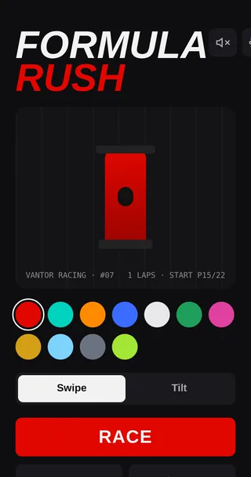
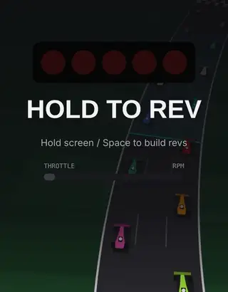
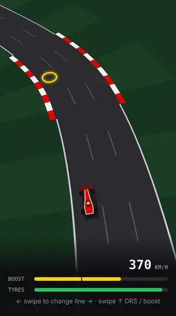
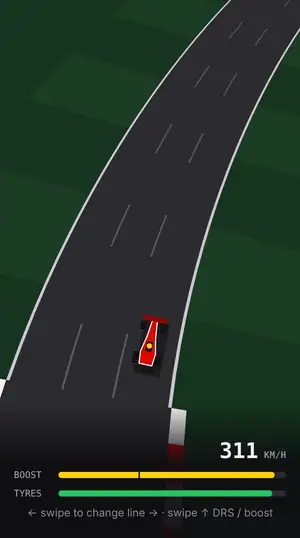
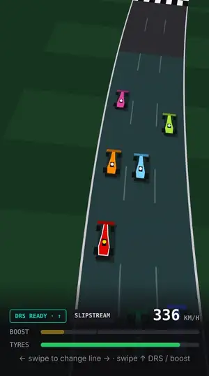

# Formula Rush

**v1.11** · 6-driver rooms with host relay, one room at a time. **v1.10** · Gentle acceleration by default, countdown launch with beeps, solo pause menu, edit your car in room lobbies. **v1.9** · Worn tyres fail; cheaper pit stops. **v1.7** · More realistic engine sound (combustion-pulse synthesis). **v1.6** · Engine sound and a sound-start fix. **v1.5** · Tyre compounds and Pit Stop Rush. See [Tyres & pit stops](#tyres--pit-stops). v1.4: Garage v2 (3D car, liveries, accents) and race settings sheet.

Portrait mobile F1 racer. One-thumb controls, hybrid chase/top-down camera, 3-lap races on a 12-car grid (11 teams), and 2–6 human drivers per room over Supabase Realtime; AI fills the rest of the grid.

**Loop:** Garage → Lights Out (throttle launch) → Race → Results. Multiplayer: Create Room / Join Room (4-character code) → Lobby → synchronized start.

## How to play

| | |
|---|---|
|  | **1. Pick your car.** Spin the 3D car, pick a team (‹ › or the TEAM tab), a livery and an accent colour, choose Swipe or Tilt, set laps and weather, then tap **RACE** to take on 11 AI drivers. |
|  | **2. Nail the launch.** The five red lights count down by themselves with a beep each. Rev freely (hold to rev, let go to lift; no jump-start penalty). When they turn green, let go fast: within 0.15 s is **Perfect** (rolling start + 20 boost), within 0.35 s **Good** (small rolling start), up to 0.7 s clean, slower is a **Late start** (+0.5 s bog). If you never let go, the car goes on its own at 1.5 s, bogged. |
|  | **3. Change lines, hit apexes.** Swipe left/right between three lines. Drive through the yellow rings on the inside of corners to fill boost; inside lines are shorter. |
|  | **4. Boost.** Swipe up (↑ / Space) once the bar passes the notch for 25% more speed. |
|  | **5. DRS.** On the teal straights, get within a second of the car ahead and **DRS READY** appears. Swipe up to open it. |
| | **Brake.** Press and hold the screen without swiping (↓ / S on a keyboard) to brake and tuck in behind a car instead of hitting it. |
| | **6. Keep it clean.** Cars and walls cost speed, tyres wear, and rain cuts grip and visibility. |
| | **Tyres & Pit Stop Rush.** Pick Soft, Medium, Hard or Wet before the race. When the team calls **BOX BOX**, get on the right-hand line before the finish and swipe right into the pit lane. In the box, call your next tyres, then swipe each lit wheel in the direction shown. Under 2.0 s earns +25 boost. |
| | **7. Race friends.** Create Room → share the 4-letter code → up to 5 friends join → **Edit car** in the lobby to change team, livery, accent or starting tyres (a car change un-readies you) → everyone readies up → the host starts. AI fills the rest of the 12-car grid. |

The same guide opens in the game on first launch and from the **?** button in the Garage. Clips are real gameplay captured from the game.

## Stack

- **Vite + React + TypeScript.** The game is drawn on one `<canvas>` (2D context, manual perspective projection); screens are React overlays.
- **three.js** for the Garage car only (`src/garage/carViewer.ts`, loaded as a separate chunk the first time the Garage opens).
- **Supabase** for anonymous auth, Postgres (rooms, results, best laps) and Realtime (presence + broadcast).
- **GitHub Pages** deploy via GitHub Actions on every push to `main`.

```
src/
  game/        pure TS: track, physics, AI, weather, lights, renderer (no React)
  net/         Supabase client, room session (lobby + race sync), result saving
  garage/      three.js procedural F1 car for the Garage
  ui/          the screens: Garage, RaceSettingsSheet, Join, Lobby, Lights, Race HUD, Results
supabase/migrations/   schema, RLS and room functions
```

## Run locally

```bash
npm install
npm run dev        # http://localhost:5173
npm run build      # production build in dist/
npm run typecheck
```

Supabase settings come from `.env.development` / `.env.production` (`VITE_SUPABASE_URL`, `VITE_SUPABASE_ANON_KEY`). The publishable key is meant to ship to browsers; row-level security protects the data. Without them the game still runs solo and the room buttons show as offline.

## Supabase setup

1. Apply the files in `supabase/migrations/` in order (SQL editor, or `supabase db push`). All objects are prefixed `fr_`, so they can share a project with other apps.
2. **Authentication → Sign In / Providers → enable "Allow anonymous sign-ins".** Every driver gets an anonymous user; nothing else is required.
3. Realtime is enabled for `fr_room_players` and `fr_rooms` by the migration.

### Data model

| Table | Purpose |
|---|---|
| `fr_rooms` | code (unique while `lobby`/`racing`), host, status, laps (1–8), weather |
| `fr_room_players` | up to 4 per room, `slot` unique per room, team (0–10), livery, accent (0–4), name, ready |
| `fr_race_results` | one row per driver per finished race, incl. `pit_stops`, `best_pit` (s) and `tyres` strategy such as `S-M` |
| `fr_best_laps` | personal best per track (leaderboard, future ghosts) |
| `fr_profiles` | reserved for named profiles |

RLS: signed-in users read everything and write only their own rows. Room membership changes only through security-definer functions, which enforce the rules server-side:

- `fr_create_room(name, team, laps, weather)` picks a free code from `ABCDEFGHJKLMNPQRSTUVWXYZ23456789`.
- `fr_join_room(code, name, team)` locks the room row and raises `ROOM NOT FOUND`, `ROOM FULL (6/6)` or `RACE IN PROGRESS`.
- `fr_leave_room`, `fr_kick_player` (host drops a vanished player), `fr_claim_host` (oldest player takes over from a vanished host), `fr_set_room` (host: status/laps/weather), `fr_submit_best_lap` (keeps only improvements, rejects laps under 15 s), `fr_now` (server clock for sync).

## Garage

Hero stage with the 3D car (auto-spin, drag to spin with inertia, a spin kick on every team or livery change), the team name ghosted behind it and ‹ › team arrows. Below it: **TEAM / LIVERY / ACCENT** tabs, the race settings bar, **RACE** (solo vs AI) and **Create Room / Join Room**.

- **Liveries:** Classic (body team, sidepods team-dark), Split (body team-dark, sidepods + rear endplates team), Stripe (Classic + accent centre stripe), Stealth (carbon body, team colour on front wing and endplates, accent stripe). The accent always paints the helmet, front-wing flap and DRS flap, in the Garage and on track. AI cars keep plain team colours.
- **Race settings** open as a bottom sheet from the Garage and the Lobby: laps 1 / 3 / 5 / 8 and weather Random / Dry / Wet / Late rain. AI pace and camera tilt sit under *More*. In a room only the host can edit; guests see `SET BY HOST`. The host's changes are written to `fr_rooms` and reach guests through Realtime.

## Acceleration feel

Three acceleration feels for play-testing (`accelRate` in `src/game/constants.ts`):

| Mode | Feel | 0→300 km/h |
|---|---|---|
| **Classic** | constant push (the original feel) | ~2.8 s |
| **Curve** | strong out of corners, fades near top speed like air resistance | ~3.6 s |
| **Gentle** (default since v1.10) | softer version of Curve | ~4.9 s |

Long-press the **FORMULA RUSH** logo in the Garage (~0.7 s) to cycle modes. The current mode shows under the car when it isn't the default. Only an explicit choice is remembered (`fr-accel-v2`); the old `fr-accel` key, which earlier builds wrote for every player, is ignored so everyone moves to Gentle. `?accel=classic|curve|gentle` in the URL also works. AI cars use the same mode, about 8% softer as before. In a room, each client simulates its own car, and the host's mode drives the AI.

## Tyres & pit stops

Tyres live in `src/game/tyres.ts`; the engine applies them to every car, AI included.

| Compound | Corner grip (dry / wet) | Top speed | Life |
|---|---|---|---|
| Soft | 1.08 / 0.72 | +3.5% | 1.7 laps |
| Medium | 1.00 / 0.70 | — | 2.6 laps |
| Hard | 0.94 / 0.68 | −3.5% | 3.05 laps |
| Wet | 0.86 / 0.97 | −5% | 3.6 laps in rain; wears 2.6× faster in the dry |

- **Wear** is by distance. Boost works the tyres 1.8× harder; contact and walls take a chunk. Grip fades gently to 25%, then falls off a **cliff** (grip down to 50%, top speed down to 76%). Under 2% the tyre **fails**: the car limps at about half speed (~180 km/h cap) until it pits, with a red **TYRE FAILURE · BOX** call. The HUD shows the compound and wear; **BOX BOX** appears under 32%, **BOX FOR WETS / SLICKS** when the weather and tyres don't match.
- **Starting tyres:** RACE opens a sheet with the four compounds, a recommendation and a strategy hint for the laps and forecast. In a room, each driver picks in the lobby.
- **Pit lane:** right of the main straight. The pit window is the last ~120 units before the line (highlighted, `PIT · SWIPE →` chip). Swipe right from the right-hand line (Tilt: steer hard right) to commit. Speed limiter 52 (~210 km/h), box just past the line, exit ~90 units later. No pit stop on the final lap. Costs ~3.5 s plus the stop.
- **Pit Stop Rush:** the race clock keeps running. Call the tyres (the engineer's pick is highlighted; 1–4 on a keyboard), then four wheels light up in random order, each with an arrow: swipe (or press) that way. A wrong swipe adds 0.5 s. Under 2.0 s earns +25 boost. If nobody touches anything, the crew calls the tyres after 6 s and finishes after 12 s.
- **AI strategy:** AI cars start on a spread of compounds (wets in the rain), stop when their tyres won't make the flag, take 1.9–3.2 s stops and pick the softest compound that lasts. They box for wets when it rains.
- **Balance** (v1.10, with Gentle acceleration; 24 simulated 12-car races per strategy, test car at the player's top speed, no boost, starting last). Over 3 laps: Soft one-stop ~P7, Medium one-stop ~P8.5, Hard no-stop ~P6 but it reaches the flag at ~2% wear, so one contact or any boost turns it into a failure. Medium/Soft with no stop finish last. Gentle acceleration made stops cost more, so the pit limiter went 44 → 52 and Hard life 3.1 → 3.05 laps. Late rain arrives a quarter-lap before the final lap so there is a window to box for wets.
- **Multiplayer:** `state` carries `c` (compound index) and AI tuples carry compound and wear, so every client draws the same tyre colours. The pit lane is just a lateral position, so remote cars appear in it without extra messages.

## Multiplayer

Client-authoritative for your own car, Supabase Realtime as the relay. Channel `race:{roomId}`:

- **Presence** `{ userId }` shows who is connected. If a player is gone for 8 s the host removes them; if the host is gone, the oldest player claims host.
- **`start`** (host): `{ grid, laps, rainPlan, greenAt, lightsDelay }`; each grid entry carries the driver's team, livery and accent. Everyone runs the lights from a shared server clock (offset estimated from `fr_now` round trips), so all clients go green at the same instant. Humans start at the back of the pack in random order (P7–P12 with 6 drivers), as in solo where you start P12; AI takes the other 6–10 spots on the 12-car grid. The host needs at least 2 ready drivers to start.
- **`state`** (host relay, v1.11): `{ id, t, p, d, v, y, b, r, c }` in race time (`c` = tyre compound). Each guest sends its car only to the host on its own uplink channel `race:{roomId}:up:{userId}` (only the host listens). The host sends one combined update on the main channel with its own car, the AI cars (`ai`, `aiFin`) and the guests' latest states (`h`). Remote cars interpolate ~100 ms behind when updates are frequent and keep driving along the track (with smooth correction) when they're sparse. If the host leaves mid-race, the new host takes over the AI and starts listening on everyone's uplink.
- **`finish`**: `{ id, finishTime, best }`. Results update live as drivers cross the line.

Contacts are resolved by each client for its own car only.

### Realtime quota

Supabase counts every broadcast as **1 sent + 1 per client that receives it** (Free plan: 100 messages/s, 200 connections and 2 M messages/month for the whole project).

- **Host relay:** per update tick, guests send n−1 messages that each reach only the host (2 each), and the host sends one to the other n−1. That's **3n − 2** messages per tick, against n² for everyone-to-everyone. The rate adapts to stay under `VITE_RT_MSGS_PER_SEC` (default 85): 10 Hz for 2 drivers, 8.5 Hz for 4, 5.3 Hz for 6. A simulated 6-driver race used ~80 messages/s, and every client's view of the other cars stayed within half a car length. Before v1.11, a 4-driver room used ~107/s, which was over the free limit.
- **One room at a time** (`fr_max_rooms()` = 1, raise it on a bigger plan). Every member heartbeats the room every 20 s (`fr_room_heartbeat`). A room silent for 60 s is retired the next time someone creates one, so a crashed tab can't block the server. `fr_create_room` raises `SERVER BUSY · A ROOM IS ALREADY RUNNING` when full. The Garage polls `fr_server_status()` every 15 s and shows **Room busy** instead of Create Room; Join Room still works for the running room until it has 6 drivers.

## Deploy

`.github/workflows/deploy.yml` builds with `BASE_PATH=/<repo>/` and publishes to GitHub Pages. In the repo: **Settings → Pages → Source: GitHub Actions**. To point at another Supabase project, set repository variables `VITE_SUPABASE_URL` and `VITE_SUPABASE_ANON_KEY`.

Room invites use `?room=CODE` deep links; `404.html` is a copy of the app so links always load.

## Soundtrack

`src/audio/music.ts` is an original score synthesized live with Web Audio, so there are no audio files and nothing to license. There are four sister tracks: **Lights Out** (D minor, 120 BPM), **Slipstream** (E minor, 128), **Apex Hunter** (A minor, 124) and **Night Race** (C minor, 116). They share the same sound (a pulsing 16th-note ostinato, a pedal bass, low brass swells and drums) and differ in key, tempo, chord progression and arpeggio pattern. A random track plays in the Garage and each race moves to the next one. Layers follow the race: a calm pad in the Garage, a heartbeat and ticking that build with each red light, a hit on lights-out, the full groove while racing (brighter on boost/DRS, darker in rain), and extra percussion and a high line on the final lap.

Audio starts on the first tap or key press (a browser rule). Phones only count a tap as a gesture when the finger lifts, so the game listens for `pointerdown`, `pointerup`, `touchend`, `click` and `keydown`, and on iOS it sets `navigator.audioSession.type = 'playback'` so sound plays even with the ring/silent switch on silent. The speaker button in the Garage pulses yellow until sound has started, is white while playing and shows a cross when muted. The tap that starts the audio never also mutes it. **M** toggles all sound. Race settings → More has separate **Music** and **Engine sound** switches; all three choices are remembered.

### Engine sound

`src/audio/engineSound.ts` synthesizes an F1-style turbo V6 on the same audio context, on its own bus so it can be switched off separately from the music. There are no samples.

- **Combustion pulses, not oscillators** (`engineWorklet.ts`, an AudioWorklet): every cylinder firing is its own exhaust bang, a sharp click plus a short burst of noise. Six cylinders fire three times per revolution. Each cylinder is slightly stronger or weaker than the others, and each firing varies a little in timing and strength (more at low revs and on a closed throttle). The pulse train rings through two exhaust-pipe resonances (comb filters). That unevenness is what makes it sound mechanical rather than synthetic. Loudness is normalised for revs, so it follows the throttle.
- **Tone:** a low body resonance (~170 Hz), a presence bump for rasp (~2.6 kHz), light saturation and a low-pass that opens with throttle. There's quiet intake rush, a faint turbo/MGU-K whine on boost, and two short stereo reflections so the car sits in a space.
- **Road and wind:** low tyre rumble and a wind band that rise with speed.
- **On the grid:** a lumpy idle at ~4,200 rpm. Holding the throttle revs to the limiter, where the ignition cuts in and out, then it drops into the launch on green.
- **Racing:** an 8-speed gearbox with hysteresis and a short ignition cut on each upshift. Downshifts blip. Throttle is read from what the car is doing (accelerating / holding speed / braking or contact). Lifting off gives weak, uneven pulses with occasional overrun bangs.
- **Pit lane:** the limiter's on/off stutter, then idle in the box.
- **Rivals:** one extra engine voice follows the nearest car. It gets louder and brighter as the car closes in, pans to its side, and bends in pitch (doppler) as it passes.
- **Fallback:** browsers without AudioWorklet get the older oscillator voice.

## Controls

| Input | Action |
|---|---|
| ← → / swipe | change racing line (3 lanes) |
| ↑ / Space / swipe up | DRS when ready, otherwise boost (35 of the meter) |
| → / swipe right on the right-hand line in the pit window | take the pit lane (Tilt: steer hard right) |
| in the box: 1–4 / tap | call Soft / Medium / Hard / Wet |
| in the box: arrows / swipe | wheel guns, in the direction shown |
| hold / release on the grid | rev freely; the first release after green launches (≤0.15 s perfect, ≤0.35 s good, >0.7 s late) |
| Esc / P / pause button (solo) | pause: Resume, Restart race, Exit to Garage. The game also pauses itself when the app goes to the background. |
| Tilt mode | drag, tilt or hold arrows to steer; tap the right edge to boost |
| M | sound on/off |

Hit yellow apex rings for +30 boost. Inside lines are shorter.

Settings (gear icon in the Garage): camera tilt 35–90°, weather (Random / Dry / Rain / Rain on final lap), AI pace, laps 1–5.
